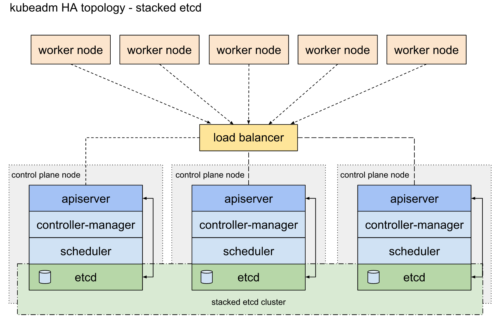

## **拓扑图**




## **硬件配置**

1. master 的高可用，需要一个前置的 vip，理想情况是用 F5 硬件，如不能提供，需要分配一个**空的 ip，两台 4c8g 小型机器**，使用 keepalived + haproxy 实现，则架构图中的 **load balancer** 部分如下图。

   

   

## **软件版本**

| 组件       | 版本       | 备注               |
| ---------- | ---------- | ------------------ |
| os         | centos 7.8 | 部署时分区使用 lvm |
| kubernetes | v1.21.4    |                    |
| docker     | 20.10.7    |                    |

## **部署过程**

```shell
kube-init/workflow          #  repo 中 workflow 文件夹中包含以下脚本      
├── 1-prepare.sh            #  基础配置，所有节点都执行      
├── 2-registry.sh           #  部署私有镜像仓库，kubernetes master 任一节点执行 
├── 3-vip.sh                #  部署 keepalived 和 haproxy， vip 两个节点上执行  
├── 4-yum.sh                #  添加 yum 源并安装 docker kube* 包，kubernetes 所有节点执行    
├── 5-kubeadm-init.sh       #  使用 kubeadm 创建高可用集群，kubernetes master 任一节点执行
├── 6-kubeadm-join.sh       #  上一步选择的节点执行，然后复制输出的命令，到其他 master 节点和 node 节点执行 
├── 7-flannel.sh            #  部署 flannel，任一 master 节点执行
└── 8-gpu.sh                #  TODO
```

**操作时需要修改的部分**：

```shell
#  rg export kube-init/workflow              利用 ripgrep 搜索脚本中所有定义变量的位置
kube-init/workflow/7-flannel.sh              #  7-flannel.sh  需要修改
1:export PODSUBNET="10.244.0.0/16"           #  部署 flannel 前需要定义 pod 子网，可以不改

kube-init/workflow/5-kubeadm-init.sh         # 5-kubeadm-init.sh 需要修改
1:export VIP="192.168.137.248"               # 用于高可用的虚拟 ip
2:export PODSUBNET="10.244.0.0/16"           # pod 子网，与 flannel 文件中保持一致，可以不改
3:export SVCSUBNET="10.96.0.0/12"            # service 子网，可以不改

kube-init/workflow/6-kubeadm-join.sh         # 6-kubeadm-join.sh 需要修改
1:export VIPAPISERVER="192.168.137.248:6443" # 高可用 vip + 6443，即高可用 apiserver 的 ip:port
# 以下三行不需要修改，是简化代码的变量
5:export CACERTHASH=$(openssl x509 -pubkey -in /etc/kubernetes/pki/ca.crt | openssl rsa -pubin -outform der 2>/dev/null | openssl dgst -sha256 -hex | sed 's/^.* //')
6:export TOKEN=$(kubeadm token list | grep system | awk '{print $1}')
7:export CERTKEY=$(kubeadm init phase upload-certs --upload-certs | sed -n '$p')

kube-init/workflow/3-vip.sh                  #  3-vip.sh 需要修改
1:export VIP="192.168.137.248"               # 填写 vip
2:export VIP1="192.168.137.246"              # 部署 keepalived 和 haproxy 的节点 一 ip
3:export VIP2="192.168.137.247"              # 部署 keepalived 和 haproxy 的节点 二 ip
4:export MASTER1="192.168.137.221"           # kubernetes 集群 master 一
5:export MASTER2="192.168.137.220"           # kubernetes 集群 master 二
6:export MASTER3="192.168.137.219"           # kubernetes 集群 master 三
8:export IFACE="eth0"                        # ip 对应的网卡名称，多个节点网卡名称需要保持一致
# 以下三行不需要修改，是简化代码的变量
10:export OWNIP=$(ip a s ${IFACE} | egrep -o 'inet [0-9]{1,3}\.[0-9]{1,3}\.[0-9]{1,3}\.[0-9]{1,3}' | cut -d' ' -f2)
13:    export PARTNERIP=${VIP2}
15:    export PARTNERIP=${VIP1}

```

# TODO

1. gpu manager 验证
2. 将所有用到的镜像同步到公司内部 harbor 
3. 新建环境时在集群中创建高可用 registry，依赖的镜像同步到此仓库集中管理
4. prometheus 集成
5. dashboard 部署
6. 可以考虑增加 shell 脚本或者 ansible playbook 整合以上内容（可选，用 python 实现可以做更多工作）
7. 使用 python 把所有过程整合起来，增加执行前的检查和异常捕获，提供页面收集必须的信息后运行

